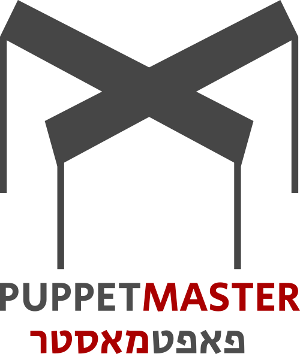

#

#

#

# Puppet Master Coding Standard

## File name

### php

ClassName.class.cntrl.php, ClassName.class.model.php, ClassName.class.help.php, functionName.fun.help.php, templateName.tpl.php, settings.ini.php, viewName.view.html.php

### js

ClassName.class.js, functionName.fun.js

### sass

choose @mixin over @extend

## Coding on "sys", "core"

### php/js

someFunction, someVariable, PM_SOME_CONSTANT, someMethod, someProperty

### php

SomeClass > using namespaces

### js

SomeClass > using custom namespaces system

### css/html

SASS as precompiler (SCSS)

### js

framework/libraries allowed:  
lodash  
RE:DOM  
babel as precompiler

## Coding on "usr"

### php/js

APP_SOME_CONSTANT

### css/html

.tagname_someclass . tagname_someclass_item --sometweak

## Coding general

### php/js

"" not ''

### php/js

interpolation over concatenation  
oop over the rest  
constants over variables where possible  
true/false NOT 1/0

### js

trying use the newest features and syntax (babel)  
no "getElement(s)" > only querySelect(All)  
only let, not var  
eslint: jshint esversion: 6  
strict mode:

### php

using latest release - 1,
never only unique to latest release features
strict mode: declare(strict_types=1); (PHP interfaces SHOULD NOT have this declaration)
no templating engines - php IS templating engine
if possible write php in html NOT echoing html in php
if still using html in php - use Html class (helper)
